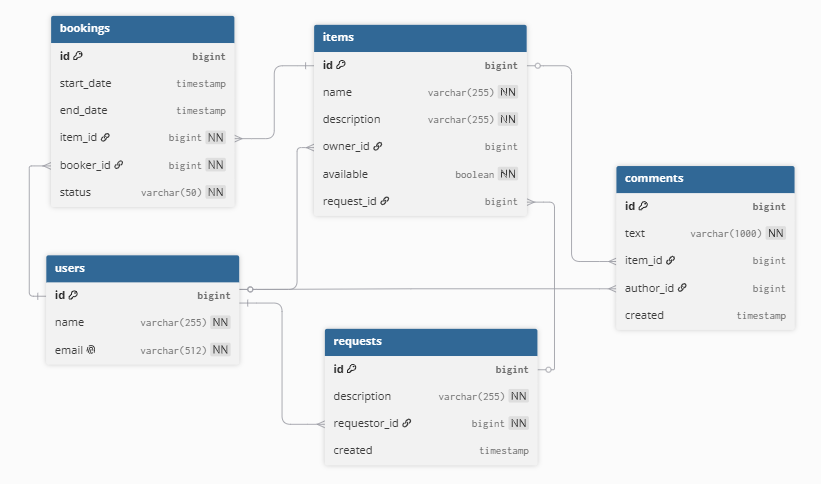

# Приложение Shareit

## Схема базы данных



### Архитектура и бизнес-логика приложения

Приложение спроектировано по **микросервисной архитектуре** и разделено на два независимых модуля, общающихся между 
собой по REST API:

1. **ShareIt-Gateway (Шлюз)**
    - Принимает все внешние запросы от пользователей.
    - Отвечает за первичную валидацию входных данных (например, проверку корректности дат бронирования 
`start_date` < `end_date`, валидацию формата `email` и непустых полей DTO).
    - Управляет заголовками авторизации (проверяет наличие ID пользователя `X-Sharer-User-Id` в запросах).
    - Защищает основной сервер от некорректных запросов, снижая на него нагрузку.

2. **ShareIt-Server (Основной сервер)**
    - Содержит всю бизнес-логику приложения и напрямую взаимодействует с базой данных (структура таблиц представлена 
выше).
    - Принимает от Gateway уже валидные, «чистые» данные и выполняет транзакционные операции.

---

### Функциональные модули системы

Логика приложения завязана на предоставленную структуру таблиц и разделена на следующие блоки:

#### 1. Управление пользователями (users)
- **Регистрация и аутентификация:** Система регистрирует пользователей с уникальным `email`. Пользователь может 
выступать в роли владельца вещи (owner), арендатора (booker) или автора отзывов (author).

#### 2. Добавление и поиск вещей (items)
- **Размещение вещей:** Владелец может добавить вещь (`name`, `description`) и указать её текущую доступность для аренды
(`available = true/false`).
- **Публичный поиск:** Любой пользователь может искать доступные вещи по ключевым словам в названии или описании через 
полнотекстовый поиск.

#### 3. Бронирование и аренда (bookings)
- **Запрос на аренду:** Пользователь (за исключением самого владельца) может отправить запрос на бронирование вещи на 
определенный промежуток времени (`start_date` и `end_date`).
- **Жизненный цикл бронирования:** Запись создается в статусе `WAITING` (Ожидает подтверждения). Владелец вещи должен 
либо подтвердить бронирование (статус меняется на `APPROVED`), либо отклонить его (`REJECTED`).
- **Фильтрация бронирований:** Система позволяет пользователям и владельцам просматривать свои бронирования, фильтруя 
их по времени: текущие (`CURRENT`), прошлые (`PAST`), будущие (`FUTURE`) или по статусу.

#### 4. Запросы на создание вещей (requests)
- **Поиск редких вещей:** Если пользователь не нашел нужную вещь в поиске, он может создать запрос (`description`).
- **Ответ на запрос:** Другие пользователи видят этот список и при добавлении новой вещи могут указать `request_id`. 
Таким образом, вещь создается «под запрос», а автор запроса получает уведомление.

#### 5. Отзывы и комментарии (comments)
- **Обратная связь:** После завершения срока аренды арендатор (`author_id`) может оставить текстовый отзыв (`text`)
к использованной вещи.
- **Бизнес-валидация:** Сервер строго запрещает оставлять комментарии пользователям, которые не брали эту вещь в аренду,
или если срок их аренды еще не наступил или не завершился.

---

### Примеры ключевых SQL-запросов для основных операций:

1) Получение владельцем списка всех своих вещей с данными бронирований и комментариями — findAll():
   ```sql
   -- Шаг 1: Получение всех вещей конкретного владельца
   SELECT * FROM items WHERE owner_id = {ownerId};

   -- Шаг 2: Поиск дат окончания последних одобренных бронирований (до текущего момента) для списка вещей
   SELECT item_id, MAX(end_date) AS last_booking_end
   FROM bookings
   WHERE item_id IN ({item_ids}) AND status = 'APPROVED' AND start_date < NOW()
   GROUP BY item_id;

   -- Шаг 3: Поиск дат начала следующих одобренных бронирований (после текущего момента) для списка вещей
   SELECT item_id, MIN(start_date) AS next_booking_start
   FROM bookings
   WHERE item_id IN ({item_ids}) AND status = 'APPROVED' AND start_date > NOW()
   GROUP BY item_id;

   -- Шаг 4: Получение всех комментариев для этого списка вещей
   SELECT c.*, u.name AS author_name FROM comments AS c JOIN users AS u ON c.author_id = u.id 
   WHERE c.item_id IN ({item_ids});
   ```

2) Создание новой вещи (с опциональной привязкой к запросу) — createItem():
   ```sql
   INSERT INTO items (name, description, owner_id, available, request_id)
   VALUES ({itemRequest.getName()}, {itemRequest.getDescription()}, {userId}, {itemRequest.getAvailable()}, 
   {itemRequest.getRequestId()});
   ```

3) Обновление данных вещи её владельцем — updateItem():
   ```sql
   UPDATE items
   SET 
       name = COALESCE({itemRequest.getName()}, name),
       description = COALESCE({itemRequest.getDescription()}, description),
       available = COALESCE({itemRequest.getAvailable()}, available)
   WHERE id = {itemId} AND owner_id = {ownerId};
   ```

4) Получение вещи по ID (с расчетом бронирований для владельца) — findItemById():
   ```sql
   SELECT * FROM items WHERE id = {itemId};
   SELECT c.*, u.name AS author_name FROM comments AS c JOIN users AS u ON c.author_id = u.id 
   WHERE c.item_id = {itemId};
   -- Запросы бронирований выполняются только если ownerId совпадает с владельцем вещи:
   SELECT MAX(end_date) FROM bookings WHERE item_id = {itemId} AND status = 'APPROVED' AND start_date < NOW();
   SELECT MIN(start_date) FROM bookings WHERE item_id = {itemId} AND status = 'APPROVED' AND start_date > NOW();
   ```

5) Публичный поиск доступных вещей арендатором — findItemToBooking():
   ```sql
   SELECT * FROM items 
   WHERE available = TRUE 
     AND (LOWER(name) LIKE {text} OR LOWER(description) LIKE {text});
   ```

6) Добавление отзыва к вещи после завершения аренды — addComment():
   ```sql
   -- Валидация: проверка, что автор пользовался вещью и аренда уже завершилась
   SELECT EXISTS (
       SELECT 1 FROM bookings 
       WHERE booker_id = {authorId} AND item_id = {itemId} AND end_date < NOW() AND status = 'APPROVED'
   ) AS is_valid_booker;

   -- Вставка комментария
   INSERT INTO comments (text, item_id, author_id, created) 
   VALUES ({commentRequest.getText()}, {itemId}, {authorId}, NOW());
   ```

7) Регистрация нового пользователя с проверкой уникальности почты — createUser():
   ```sql
   -- Валидация уникальности Email
   SELECT id FROM users WHERE email = {userRequest.getEmail()};

   -- Создание пользователя
   INSERT INTO users (name, email) VALUES ({userRequest.getName()}, {userRequest.getEmail()});
   ```

8) Получение истории бронирований текущего пользователя по состояниям (State) — findAllBookingsByUser():
   ```sql
   -- С условным переключателем (switch-case) на уровне Java-приложения:
   
   -- CASE ALL: Все бронирования пользователя
   SELECT * FROM bookings WHERE booker_id = {userId} ORDER BY start_date DESC;

   -- CASE CURRENT: Текущие активные бронирования
   SELECT * FROM bookings WHERE booker_id = {userId} AND start_date <= NOW() AND end_date >= NOW() 
   ORDER BY start_date DESC;

   -- CASE PAST: Завершенные бронирования
   SELECT * FROM bookings WHERE booker_id = {userId} AND end_date < NOW() ORDER BY start_date DESC;

   -- CASE FUTURE: Будущие бронирования
   SELECT * FROM bookings WHERE booker_id = {userId} AND start_date > NOW() ORDER BY start_date DESC;

   -- CASE WAITING / REJECTED: Фильтрация по статусу
   SELECT * FROM bookings WHERE booker_id = {userId} AND status = {status} ORDER BY start_date DESC;
   ```

9) Создание и получение списка чужих запросов на вещи — ItemRequests:
   ```sql
   -- Создание нового запроса на вещь (createItemRequest)
   INSERT INTO requests (description, requestor_id, created) VALUES ({request.getDescription()}, {userId}, NOW());

   -- Получение списка запросов других пользователей, отсортированных от новых к старым (findAllItemRequests)
   SELECT * FROM requests WHERE requestor_id != {requestorId} ORDER BY created DESC;
   ```

### ТЕХНОЛОГИЧЕСКИЙ СТЕК
* Язык и окружение: Java 21 (Amazon Corretto), Maven (Мультимодульный проект: `gateway`, `server`)
* Фреймворк: Spring Boot 3.3.2, Spring Data JPA, Spring Web
* Валидация и сериализация: Jakarta Validation API, Jackson
* База данных: PostgreSQL, H2 (для тестов)
* Инструменты: Docker, Docker Compose, Lombok
